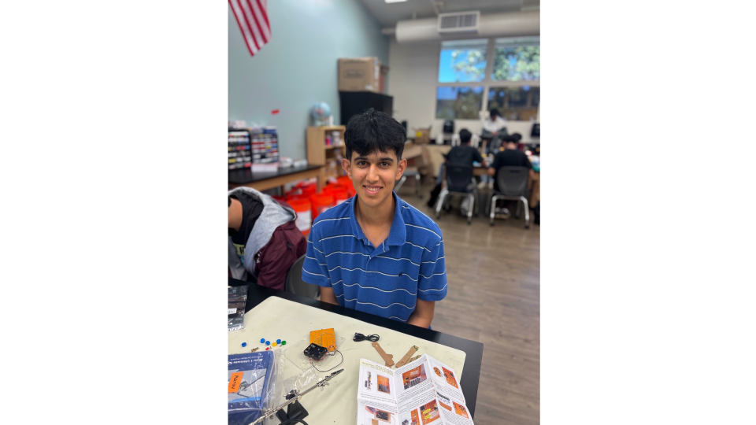

# Self Driving Car
The Self Driving Car uses various modules, boards, breadboards, wires, and motors to allow the car to move by itself in all directions with a change of speed, also being able to detect obstacles and navigate away from them when encountered. Coding is an essential part of contributing to the Arduino Self Driving Car, as C++ is used for the car's basic functions-allowing the car to move backward or left- and advanced functions-avoiding obstacles and tracking lines. 

| **Engineer** | **School** | **Area of Interest** | **Grade** |
|:--:|:--:|:--:|:--:|
| Aarav M | American High School | Data Science | Incoming Senior

  

# Final Milestone

<iframe width="560" height="315" src="https://www.youtube.com/embed/ZerwUfCBL3A?si=v3Rmr5HNRXRjFPK5" title="YouTube video player" frameborder="0" allow="accelerometer; autoplay; clipboard-write; encrypted-media; gyroscope; picture-in-picture; web-share" referrerpolicy="strict-origin-when-cross-origin" allowfullscreen></iframe>

## Summary
Since the second milestone, there has been significant progress into my main project, to which I have finished without the modifications. My second milestone marked the time when I finished inputting code for the Ultrasonic and Obstacle Avoidance Module, but since then I have made significant progress in more advanced mechanisms. Specifically, I coded it to fully drive by itself, move in all directions and various speeds, work by using a remote control, and accelerate/deaccelerate. Coding was the only work I changed from the second to this milestone, so all my work was done in the Arduino portal and many changes were done there. 

## Challenges
I faced a few challenges when coding, especially when organizing the code since I was getting errors when some pieces of codes were in certain locations. Sometimes some errors gave a vague description of the error, so correcting them and knowing what to do took some more time and was a challenge that I faced as well. Sometimes the code on the Arduino website contained instructions only for smaller parts of the project, so I had to manially filter out which pieces of code I wanted to include to make sure I did not get repetition in the overall code. 

## Challenges and Triumphs at BSE 
Overall, I had a great time at BlueStamp, but there were many challenges I faced while working on my project. Since I started the program almost from complete scratch, with minimal experience in programming and none in robotics, some steps came harder for me than others. Construction and management of wires was difficult since there were many inputs and outputs I was not familiar with, and the task of color coding the wires along with putting them in an exact position posed as an obstacled and took me a few days to figure out. However, the biggest challenge I personally faced in my time working on my project at BlueStamp lay in the coding. The first time looking at the code, I could not interpret any section of it since I was learning C++, a completely new language. However, I was able to read and understand each line of code that was in the instructions for code, which helped me understand what I was actually writing and where I could troubleshoot errors. In spite of all these obstacles that I faced, the program gave me many triumphs and takeaways. I was successfully able to navigate my way around big setbacks with minimal help from instructors, and the overall hard work that I have put in across the program. The program is six weeks long, coming in four hours a day every weekday, so being able to consistently show up and be productive today got me to where I am today with a well built and developed project.

## Learnings and Next Steps
Out of the many topics I learned at BlueStamp, I felt some were more important and needed to be talked about more. Learning how to solder, how breadboards worked, how important it was for wire connections to go to the right location, how to code in C++ and interpret errors, etc... were topics that I used heavily throughout the program. Even after the completion of the program, I want keep learning similar ideas I learned during my time at BlueStamp. I found the short lectures the instructors gave us about the way certain components function entertaining, so being able to expand my engineering knowledge is an area I wish to tackle in the near future.

# Second Milestone

<iframe width="560" height="315" src="https://www.youtube.com/embed/dn7C1Sk9gT8?si=jDRwITQU59p00hqf" title="YouTube video player" frameborder="0" allow="accelerometer; autoplay; clipboard-write; encrypted-media; gyroscope; picture-in-picture; web-share" referrerpolicy="strict-origin-when-cross-origin" allowfullscreen></iframe>

## Summary
Since my first milestone, I have been able to complete much more advanced movements of the Self Driving Car, specifcally the car being able to avoid obstacles using the Obstacle Avoidance and the Ultrasonic Module. I implemented code that allowed the car to move left, right, forward, and backward. I also coded to avoid obstacles, where the sensors in the Obstacle Avoidance Module detected any object in the way, which then stopped the car and allowed it to move in another direction. In the final goal, this will be one of the parts that allows the car to move following the guide of a hand, with a remote control, and at different speeds. A noticeable part of the project that has surprised is how major of a change a minor fix to code or wiring can do to the car. Specifically, I noticed that when I changed the positioning of my wiring, the speed of my car changed. Also, changing the numerical value of a pin in my code had a drastic change on the motor function of my car.

## Challenges
In the midst of all this, however, there were multiple challenges I faced on my way to completing the Second Milestone. The most time consuming and confusing challenge I faced lay in my coding. I used multiple sections of the code given on the Sunfounder website and put it into one whole large code, which had an abundancy of errors when I tried to upload it. I worked for a few days trying to modify the code and fix all the errors, but eventually it was too much and I realized it was not a good use of my time. I then proceeded to upload a smaller piece of code that focused only on avoiding obstacles and recognizing the Ultrasound Module, which was successful and allowed me to get my car moving while also avoiding obstacles. Another issue I faced lay in the wiring, which was an easy fix, as all I needed to do was put some wires in the R3 Board instead of the breadboard and my issue was solved. My last issue was that the car was not moving in a straight line, but kept circling around with one motor dominating the movement. I resolved this problem by inputting a 3ohms resistor into the motor function and the car was then able to move in a straight line. I tried resistors of different ohm values to see if it would yield more accurate results for the car moving in a straight line, but nothing worked as well as the 3ohms resistor so I decided to stick with that. 

## Next Steps
Before my final milestone is recorded, I need to input the other pieces of code, such as the remote control function, the speed change function, and the hand following function. This will allow me to have a fully independent car which can move in all directions at various speeds, functioning almost like an actual car.

# First Milestone

<iframe width="560" height="315" src="https://www.youtube.com/embed/K4oKiaYhPPw?si=pYo9yJwl9OftwOb2" title="YouTube video player" frameborder="0" allow="accelerometer; autoplay; clipboard-write; encrypted-media; gyroscope; picture-in-picture; web-share" referrerpolicy="strict-origin-when-cross-origin" allowfullscreen></iframe>

## Summary
The Self Driving Car is a project where a car drives by itself using various coding properties, combination of wires, and modules. This self driving car will be able to navigate itself in different directions and change speed. My building plan for the car is to build the entire car before adding any code, which means connecting all the wires needed and placing it on the mini breadboard as well as installing all necessary modules. The car, when plugged in, will be able to move by itself in a constant speed and direction with the line tracking and L9110 modules lighting up and being active. In terms of progress, I was able to successfully construct the whole car with all of the necessary wire connections, installing modules and connecting those wires back to the breadboard and R3 Board. I installed necessary motors and a battery for the car to move, and eventually when I plugged in my battery cable to the R3 Board, the car began to move on its own at a constant velocity. 

## Challenges 
All this progress definitely did not come without any challenges however, as I faced a fair share of them when building. My biggest was when I had completed screwing almost everything and had started wiring, but when installing the R3 Board I realized I had done everything upside down, so I had to unscrew and unwire everything and start over. This was not a large technical issue, but it did set me back for a day. Wiring too was an issue considering the plethora of wires that were needed to be connected to the breadboard and R3 board, so wire management became tricky and I had to deter from the instructions to make sure I could keep all the wires in a consistent place.

## Next Steps
Before my second milestone, my wish is to incorporate all the code that is needed for the car to move following a straight line and can avoid obstacles, before I work on regulating speed and direction for my last milestone.  

# Starter Project - Handheld DIY Game Kit

<iframe width="560" height="315" src="https://www.youtube.com/embed/SV2B-dmxS5s?si=pYqkjdMHAoVgNXuH" title="YouTube video player" frameborder="0" allow="accelerometer; autoplay; clipboard-write; encrypted-media; gyroscope; picture-in-picture; web-share" referrerpolicy="strict-origin-when-cross-origin" allowfullscreen></iframe>

For the beginning of my journey at BlueStamp, I chose for my starter project to be the Handheld Game DIY Kit. This project uses basic soldering techniques to make a portable game device which can run different games such as Tetris, Snake, Space Destroyers, etc... The device runs on three AAA batteries, but the composition of its components are either soldered or placed on a board. 

## Challenges Faced

Overall, the project was not too difficult after learning how to properly solder, but I still had a few challenges while making. There were smaller crevices where it was noticably harder to solder due to the gaps between each joint, which was an obstacle I had encountered for the first time when soldering the project. As a result, after completion there was an issue of a line always being existent no matter what game mode it was on, and this was due to two different joints being connected to one solder. I had to use multiple pieces of tape when building since some of the cable wires were not staying within the board and my battery pack did not stick to the backside of the board. 

# Schematics 

*Note: All wires are color coded according to what is on the car, black wires showing a GND connections.*

# Code

```c++
#include <EEPROM.h>
#include <IRremote.h>
#include <Adafruit_MPU6050.h>
#include <Adafruit_Sensor.h>
#include <Wire.h>

Adafruit_MPU6050 mpu;

float leftOffset = 1.0;
float rightOffset = 1.0;

const int A_1B = 5;
const int A_1A = 6;
const int B_1B = 9;
const int B_1A = 10;

const int rightIR = 7;
const int leftIR = 8;

const int trigPin = 3;
const int echoPin = 4;

const int IR_RECEIVE_PIN = 12;

const int lineTrackPin = 2;

int speed = 150;
String flag = "NONE";

float readSensorData() {
  digitalWrite(trigPin, LOW);
  delayMicroseconds(2);
  digitalWrite(trigPin, HIGH);
  delayMicroseconds(10);
  digitalWrite(trigPin, LOW);
  float distance = pulseIn(echoPin, HIGH) / 58.00; //Equivalent to (340m/s*1us)/2
  return distance;
}

void setup() {
    Serial.begin(9600);

    //motor
    pinMode(A_1B, OUTPUT);
    pinMode(A_1A, OUTPUT);
    pinMode(B_1B, OUTPUT);
    pinMode(B_1A, OUTPUT);

    //IR obstacle
    pinMode(leftIR, INPUT);
    pinMode(rightIR, INPUT);

    //Line Track Module
    pinMode(lineTrackPin, INPUT);

    //ultrasonic
    pinMode(echoPin, INPUT);
    pinMode(trigPin, OUTPUT);

    //IR Remote
    IrReceiver.begin(IR_RECEIVE_PIN, ENABLE_LED_FEEDBACK);
    Serial.println("REMOTE CONTROL START");

    EEPROM.write(0, 100); //write the offset to the left motor
    EEPROM.write(1, 100); //write the offset to the right motor
    leftOffset = EEPROM.read(0) * 0.01;//read the offset of the left motor
    rightOffset = EEPROM.read(1) * 0.01;//read the offset of the right motor
    moveRight(speed);
    delay(2500);
    moveLeft(speed);
    delay(2150);
  

  Serial.println("Adafruit MPU6050 test!");

  // Try to initialize!
  if (!mpu.begin()) {
    Serial.println("Failed to find MPU6050 chip");
    while (1) {
      delay(10);
    }
  }
  Serial.println("MPU6050 Found!");

  mpu.setAccelerometerRange(MPU6050_RANGE_8_G);
  Serial.print("Accelerometer range set to: ");
  switch (mpu.getAccelerometerRange()) {
  case MPU6050_RANGE_2_G:
    Serial.println("+-2G");
    break;
  case MPU6050_RANGE_4_G:
    Serial.println("+-4G");
    break;
  case MPU6050_RANGE_8_G:
    Serial.println("+-8G");
    break;
  case MPU6050_RANGE_16_G:
    Serial.println("+-16G");
    break;
  }
  mpu.setGyroRange(MPU6050_RANGE_500_DEG);
  Serial.print("Gyro range set to: ");
  switch (mpu.getGyroRange()) {
  case MPU6050_RANGE_250_DEG:
    Serial.println("+- 250 deg/s");
    break;
  case MPU6050_RANGE_500_DEG:
    Serial.println("+- 500 deg/s");
    break;
  case MPU6050_RANGE_1000_DEG:
    Serial.println("+- 1000 deg/s");
    break;
  case MPU6050_RANGE_2000_DEG:
    Serial.println("+- 2000 deg/s");
    break;
  }

  mpu.setFilterBandwidth(MPU6050_BAND_21_HZ);
  Serial.print("Filter bandwidth set to: ");
  switch (mpu.getFilterBandwidth()) {
  case MPU6050_BAND_260_HZ:
    Serial.println("260 Hz");
    break;
  case MPU6050_BAND_184_HZ:
    Serial.println("184 Hz");
    break;
  case MPU6050_BAND_94_HZ:
    Serial.println("94 Hz");
    break;
  case MPU6050_BAND_44_HZ:
    Serial.println("44 Hz");
    break;
  case MPU6050_BAND_21_HZ:
    Serial.println("21 Hz");
    break;
  case MPU6050_BAND_10_HZ:
    Serial.println("10 Hz");
    break;
  case MPU6050_BAND_5_HZ:
    Serial.println("5 Hz");
    break;
  }

  Serial.println("");
  delay(100);
}

void moveForward(int speed) {
    analogWrite(A_1B, 0);
    analogWrite(A_1A, int(speed * leftOffset));
    analogWrite(B_1B, int(speed * rightOffset));
    analogWrite(B_1A, 0);
}

void moveBackward(int speed) {
    analogWrite(A_1B, speed);
    analogWrite(A_1A, 0);
    analogWrite(B_1B, 0);
    analogWrite(B_1A, speed);
}

void backLeft(int speed) {
    analogWrite(A_1B, speed);
    analogWrite(A_1A, 0);
    analogWrite(B_1B, 0);
    analogWrite(B_1A, 0);
}

void turnLeft(int speed) {
  analogWrite(A_1B, 0);
  analogWrite(A_1A, speed);
  analogWrite(B_1B, 0);
  analogWrite(B_1A, speed);
}

void moveLeft(int speed) {
  analogWrite(A_1B, 0);
  analogWrite(A_1A, speed);
  analogWrite(B_1B, 0);
  analogWrite(B_1A, 0);
}

void moveRight(int speed) {
  analogWrite(A_1B, 0);
  analogWrite(A_1A, 0);
  analogWrite(B_1B, speed);
  analogWrite(B_1A, 0);
}

void backRight(int speed) {
    analogWrite(A_1B, 0);
    analogWrite(A_1A, 0);
    analogWrite(B_1B, 0);
    analogWrite(B_1A, speed);
}

void turnRight(int speed) {
  analogWrite(A_1B, speed);
  analogWrite(A_1A, 0);
  analogWrite(B_1B, speed);
  analogWrite(B_1A, 0);
}

void stopMove() {
  analogWrite(A_1B, 0);
  analogWrite(A_1A, 0);
  analogWrite(B_1B, 0);
  analogWrite(B_1A, 0);
}

void AutoDrive(int speed) {
  int left = digitalRead(leftIR);  // 0: Obstructed   1: Empty
  int right = digitalRead(rightIR);

  if (!left && right) {
    backLeft(speed);
  } else if (left && !right) {
    backRight(speed);
  } else if (!left && !right) {
    moveBackward(speed);
  } else {
    float distance = readSensorData();
    Serial.println(distance);
    if (distance > 10) {  // Safe
      moveForward(200);
    } else if (distance < 10 && distance > 2) {  // Attention
      moveBackward(200);
      delay(1000);
      backLeft(150);
      delay(500);
    } else {
      moveForward(150);
    }
  }
}

void lineTrack(int speed) {
  int lineColor = digitalRead(lineTrackPin);  // 0:white  1:black
  Serial.println(lineColor);
  if (lineColor) {
    moveLeft(speed);
  } else {
    moveRight(speed);
  }
}

void ultrasonicExample(int speed) {
  float distance = readSensorData();
  Serial.println(distance);
  if (distance > 25) {
    moveForward(speed);
  } else if (distance < 25 && distance > 2) {
    moveBackward(speed);
  } else {
    stopMove();
  }
}

void irobstacleExample(int speed) {
  int left = digitalRead(leftIR);  // 0: Obstructed   1: Empty
  int right = digitalRead(rightIR);

  if (!left && right) {
    backLeft(speed);
  } else if (left && !right) {
    backRight(speed);
  } else if (!left && !right) {
    moveBackward(speed);
  } else {
    stopMove();
  }
}

void following(int speed) {
  float distance = readSensorData();

  int left = digitalRead(leftIR);  // 0: Obstructed   1: Empty
  int right = digitalRead(rightIR);

  if (distance > 5 && distance < 10) {
    moveForward(speed);
  }
  if (!left && right) {
    turnLeft(speed);
  } else if (left && !right) {
    turnRight(speed);
  } else {
    stopMove();
    delay(20);
    moveBackward(speed);
    delay(20);
  }
}

 String decodeKeyValue(long result)
{
  switch(result){
    case 0x16:
      return "0";
    case 0xC:
      return "1"; 
    case 0x18:
      return "2"; 
    case 0x5E:
      return "3"; 
    case 0x8:
      return "4"; 
    case 0x1C:
      return "5"; 
    case 0x5A:
      return "6"; 
    case 0x42:
      return "7"; 
    case 0x52:
      return "8"; 
    case 0x4A:
      return "9"; 
    case 0x9:
      return "+"; 
    case 0x15:
      return "-"; 
    case 0x7:
      return "EQ"; 
    case 0xD:
      return "U/SD";
    case 0x19:
      return "CYCLE";         
    case 0x44:
      return "PLAY/PAUSE";   
    case 0x43:
      return "FORWARD";   
    case 0x40:
      return "BACKWARD";   
    case 0x45:
      return "POWER";   
    case 0x47:
      return "MUTE";   
    case 0x46:
      return "MODE";       
    case 0x0:
      return "ERROR";   
    default :
      return "ERROR";
    }
}
void loop() {

    int left = digitalRead(leftIR);   // 0: Obstructed  1: Empty
    int right = digitalRead(rightIR);

    if (!left && right) {
        backLeft(speed);
    } else if (left && !right) {
        backRight(speed);
    } else if (!left && !right) {
        moveBackward(speed);
    } else {
        moveForward(speed);
    }
    float distance = readSensorData();
    /*
    if (distance > 25) {
        moveForward(200);
  }
    else if (distance < 25 && distance > 2) {
        moveBackward(200);
  } else {
        stopMove();
  }
  */
    if (IrReceiver.decode()) {
        String key = decodeKeyValue(IrReceiver.decodedIRData.command);
        if (key != "ERROR") {
            Serial.println(key);

            if (key == "+") {
                speed += 50;
            } else if (key == "-") {
                speed -= 50;
            } else if (key == "2") {
              moveForward(speed);
              delay(1000);
            } else if (key == "1") {
              moveLeft(speed);
            } else if (key == "3") {
              moveRight(speed);
            } else if (key == "4") {
              turnLeft(speed);
            } else if (key == "6") {
              turnRight(speed);
            } else if (key == "7") {
              backLeft(speed);
            } else if (key == "9") {
              backRight(speed);
            } else if (key == "8") {
              moveBackward(speed);
              delay(1000);
            } else if (key == "CYCLE") {
              flag = "LINE";
            } else if (key == "U/SD") {
              flag = "AUTO";
            } else if (key == "0") {
              flag = "NONE";
              stopMove();
            } else if (key == "FORWARD") {
                flag = "ULTR";
            } else if (key == "BACKWARD") {
                flag = "IROB";
            } else if (key == "EQ") {
                flag = "FOLW";
            }
            if (speed >= 255) {
              speed = 255;
            }
            if (speed <= 0) {
              speed = 0;
            }
            delay(500);
            stopMove();
          }
          IrReceiver.resume();
      
      if (flag == "AUTO") {
        AutoDrive(speed);
    } else if (flag == "LINE") {
        lineTrack(speed);
    } else if (flag == "ULTR") {
        ultrasonicExample(speed);
    } else if (flag == "IROB") {
        irobstacleExample(speed);
    } else if (flag == "FOLW") {
        following(speed);
  }
   delay(50);

  sensors_event_t a, g, temp;
  mpu.getEvent(&a, &g, &temp);

  /* Print out the values */
  Serial.print("Acceleration X: ");
  Serial.print(a.acceleration.x);
  Serial.print(", Y: ");
  Serial.print(a.acceleration.y);
  Serial.print(", Z: ");
  Serial.print(a.acceleration.z);
  Serial.println(" m/s^2");

  Serial.print("Rotation X: ");
  Serial.print(g.gyro.x);
  Serial.print(", Y: ");
  Serial.print(g.gyro.y);
  Serial.print(", Z: ");
  Serial.print(g.gyro.z);
  Serial.println(" rad/s");

  Serial.print("Temperature: ");
  Serial.print(temp.temperature);
  Serial.println(" degC");

  Serial.println("");
  delay(500);
}
}
```

# Bill of Materials

| **Part** | **Note** | **Price** | **Link** |
|:--:|:--:|:--:|:--:|
| SunFounder 3 in 1 Starter Kit for Arduino Uno R3 | Kit for main project | $59.99 | <a href="https://www.amazon.com/Arduino-A000066-ARDUINO-UNO-R3/dp/B008GRTSV](https://www.amazon.com/gp/product/B0B778L1DZ?&linkCode=sl2&tag=sunfounder03-20&linkId=e800c059a16f6cb84ff3dd1e1220cd52&language=en_US&ref_=as_li_ss_tl)6/"> <ins>Link</ins> </a> |
| MPU-6050 Gyroscope | Gyroscope modification | $8.99 | <a href="https://www.amazon.com/EC-Buying-MPU-6500-Gyroscope-Accelerometer/dp/B0F98N4PB2/ref=sr_1_1_sspa?crid=856NBSTR6BUQ&dib=eyJ2IjoiMSJ9.uV_HoXZ9XecWzwViTNXUy6vD8EyQYOfIf2iGFCqgNlNY4e02wO8xm5jw4eOdKRH9YbgYLovcWnVrNXEiAlQC_9D9kHjKuDKiLc51qRrv89FuuVZAuNsEhK1Rg5WXaV3hoSYa0GAWZoYCa24osHU5g7Af5t6220B3NYjgdTR3dU4Ds47HfBkbf1NUtJsPDbpRc7hKSARb3kWJGedZuIyZ7Q2NxoSX4An7yOPnZan-W-w.0aPKvh3Q9_JFKmRhRJKhDFpaKuB0Ym1PXzGb2iwiM6Y&dib_tag=se&keywords=mpu+65060+gyroscope&qid=1784234384&sprefix=mpu+65060+gyroscope%2Caps%2C145&sr=8-1-spons&sp_csd=d2lkZ2V0TmFtZT1zcF9hdGY&psc=1"> <ins>Link</ins> </a>

# Other Resources/Examples
- Building the car and getting code for it to move (<a href="https://docs.sunfounder.com/projects/3in1-kit-v2/en/latest/car_project/car_assemble.html"> <isn>Link</ins> </a>)
- Another student's portfolio example (<a href="https://deringur.github.io/BSE_Derin_Portfolio/"> <isn>Link</ins> </a>)
- Schematic design help (<a href="https://www.remove.bg/upload"> <isn>Link</isn> </a>)

<!--
One of the best parts about Github is that you can view how other people set up their own work. Here are some past BSE portfolios that are awesome examples. You can view how they set up their portfolio, and you can view their index.md files to understand how they implemented different portfolio components.
- [Example 1](https://trashytuber.github.io/YimingJiaBlueStamp/)
- [Example 2](https://sviatil0.github.io/Sviatoslav_BSE/)
- [Example 3](https://arneshkumar.github.io/arneshbluestamp/)
-->
